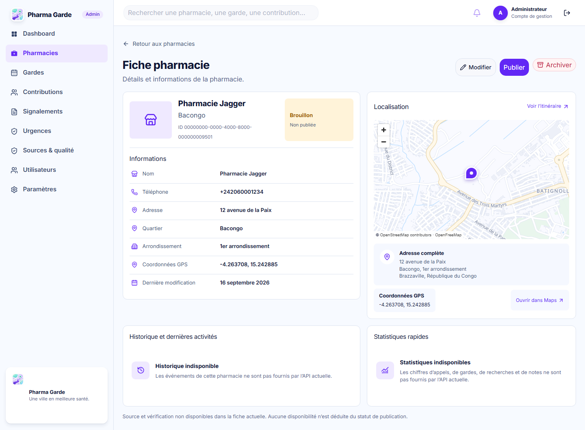

# Fiche pharmacie admin — candidat de revue #39

Référence : [`admin-pharmacy-detail.png`](mockups/admin-pharmacy-detail.png), 1586 × 992. Les captures d'implémentation ci-dessous sont produites avec une pharmacie de test, sans photo ni provenance inventée. **Ce document n'est pas une approbation de fidélité visuelle.**

| Référence desktop                                                       | Implémentation à 1440 px, fond cartographique réel                                                     |
| ----------------------------------------------------------------------- | ------------------------------------------------------------------------------------------------------ |
|  |  |

Adaptation à 390 px : . Les [captures déterministes à 1440 px](captures/admin-pharmacy-detail-1440.png), [390 px](captures/admin-pharmacy-detail-390.png) et [1586 px](captures/admin-pharmacy-detail-1586.png) sont également disponibles. Les tests ciblés vérifient aussi 320 et 768 px, avec `scrollWidth === clientWidth` aux cinq largeurs.

## Décisions fondées sur le contrat actuel

| Région de la maquette                                 | Décision dans cette PR                                                                                                                                                                                                                             | Dépendance / validation attendue                                                                                      |
| ----------------------------------------------------- | -------------------------------------------------------------------------------------------------------------------------------------------------------------------------------------------------------------------------------------------------- | --------------------------------------------------------------------------------------------------------------------- |
| Statut « Active » et bouton « Désactiver »            | `PUBLISHED` s'affiche « Publiée » ; `DRAFT` « Brouillon » ; `ARCHIVED` « Archivée ». Les actions restent `publish` et `archive` avec confirmation. La publication ne prouve ni ouverture actuelle ni garde.                                        | Une sémantique « Active/À vérifier/Masquée » demanderait une décision métier et une évolution séparée du contrat/API. |
| Photo de la pharmacie                                 | Icône de lieu neutre, pas de photo extraite de la maquette.                                                                                                                                                                                        | Asset licencié et champ API de photo si cette région doit être alimentée.                                             |
| Source et dernière vérification                       | Aucune source ni vérification attribuée. Seule `updatedAt` est présentée, explicitement comme « Dernière modification ».                                                                                                                           | Champs de provenance et vérification dans le contrat/API, après accord du lead.                                       |
| Historique, appels, gardes, recherches, note, courbes | Les deux panneaux « Historique et dernières activités » et « Statistiques rapides » conservent la géométrie et la hiérarchie de la maquette, avec des états indisponibles explicites. Aucun événement, chiffre ou sparkline de substitution.       | Issues #24/#25 et endpoints/contrats adaptés ; déviation visuelle à faire approuver.                                  |
| « Ajouter une garde »                                 | Action absente tant que le parcours #24 n'existe pas.                                                                                                                                                                                              | Route et contrat de création de garde, après #24.                                                                     |
| Localisation                                          | Carte MapLibre réelle, centrée sur les coordonnées reçues, style `/maps/wanzila-style.json` (ou `VITE_MAP_STYLE_URL`), worker dédié, attribution, redimensionnement et nettoyage. Itinéraire externe seulement quand les coordonnées sont valides. | Le rendu cartographique suit les tuiles OpenStreetMap/OpenFreeMap et ne copie pas l'illustration de la maquette.      |

Les captures à fond réel chargent le style MapLibre de production et les tuiles OpenFreeMap ; ces données cartographiques externes peuvent changer. Les captures déterministes Playwright emploient un style de test sans tuiles distantes : elles prouvent la géométrie, le chargement de MapLibre et le marqueur de façon reproductible en CI. L'écart des régions non alimentées reste **en attente d'approbation du lead** ; aucune entrée `approvedDeviations` du manifeste n'est modifiée ici.
