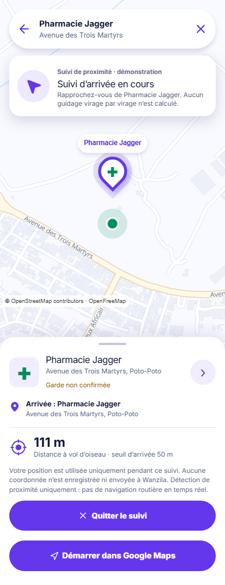

# Issue #23 — suivi d’arrivée de démonstration

References: [`mobile-navigation.png`](../../mockups/mobile-navigation.png) and [`mobile-route-preview.png`](../../mockups/mobile-route-preview.png). Per [`reference-manifest.json`](../../reference-manifest.json), compare the inner phone content, excluding the OS bar, rounded frame and lavender surround.

Implementation: [`active-390.png`](active-390.png) and [`active-1440.png`](active-1440.png), captured with the real MapLibre/OpenFreeMap style and a deterministic pharmacy/geolocation fixture. Responsive checks: [`320`](active-320.png), [`768`](active-768.png). State captures: [`arrived`](arrived-390.png), [`cancelled`](cancelled-390.png), [`location error`](error-390.png).

## Annotated differences

| Region                      | Reference                                                      | Implementation and reason                                                                                                                                                                                                                                                                                                        |
| --------------------------- | -------------------------------------------------------------- | -------------------------------------------------------------------------------------------------------------------------------------------------------------------------------------------------------------------------------------------------------------------------------------------------------------------------------- |
| Map and position            | Full-screen illustrated route, moving arrow and three controls | Existing #8 MapLibre surface remains interactive. During active tracking, it shows only the latest transient position and destination; the #8 illustrative route and fictitious origin are hidden. On arrival only the destination remains. The real map tiles vary over time. No second provider or route engine is introduced. |
| Instruction banner          | “Tournez à droite…” in 150 m                                   | “Suivi d’arrivée en cours” and an explicit demonstration label. A turn instruction cannot be derived from the available coordinates; inventing one would be unsafe.                                                                                                                                                              |
| Progress                    | 12 min and 4.5 km remaining                                    | Straight-line distance to the destination, explicitly labelled “à vol d’oiseau”, with a configurable 50 m arrival radius. No road distance, traffic or ETA is claimed.                                                                                                                                                           |
| Bottom panel                | Destination, remaining time/distance, Quitter                  | Destination/address, proximity distance, privacy disclosure, Quitter, and retained external Google Maps hand-off. The existing responsive #8 panel is reused rather than adding a separate navigation screen.                                                                                                                    |
| Extra controls              | Locate, sound, heading                                         | Omitted while tracking: there is no voice guidance or turn-by-turn route, and another location request would undermine the single consent-bound watcher. Map panning remains available.                                                                                                                                          |
| Consent and terminal states | Reference depicts active navigation only                       | Explicit start with disclosure; refusal, timeout, unavailable/unsupported, arrived, cancel and page exit stop or avoid the watcher. Error and cancellation return to the labelled #8 demonstration preview, keeping the address and external hand-off.                                                                           |

No original turn-by-turn routing data, live traffic, voice prompts or arrival artwork exists. The Jagger GeoJSON remains an illustrative fixture only on the preview surface; it is not shown as a live route during arrival tracking.

## Interaction and capture proof

- Vitest covers the geodesic distance, inclusive 50 m boundary, configurable radius, one arrival callback, refusal/timeout/unavailable/unsupported, late callbacks, cancellation and disposal.
- Playwright covers explicit start, no watcher on initial render or direct `/navigation` visit, browser history cleanup, no precise position in storage or analytics payload, one `route_started` per start click and one `arrival_confirmed` only after arrival. Both events contain only `pharmacyId`.
- Playwright checks 320/390/768/1440 px, zero horizontal overflow, keyboard order and `:focus-visible`; a DOM assertion confirms the fictitious route marker is hidden during tracking and arrival, and the current-position marker disappears on arrival. The MapLibre canvas keeps its identity across successive position fixes.
- Evidence uses the real map style, deterministic mocked API/geolocation and waits for MapLibre `idle` after every viewport/state transition, so cancelled/error screenshots include loaded tiles. Default CI mocks the map style and never depends on live tile requests.
- Only the screenshot test hides the off-screen skip link: Playwright's full-page stitching otherwise paints this fixed-position accessibility helper into the composite image at later scroll offsets. The application CSS is unchanged, and a separate browser test verifies its keyboard/focus behavior.

Visual approval: pending lead comparison against the two mobile references. The absence of turn-by-turn guidance and the responsive desktop composition are deliberate, disclosed deviations rather than claims of pixel identity.
