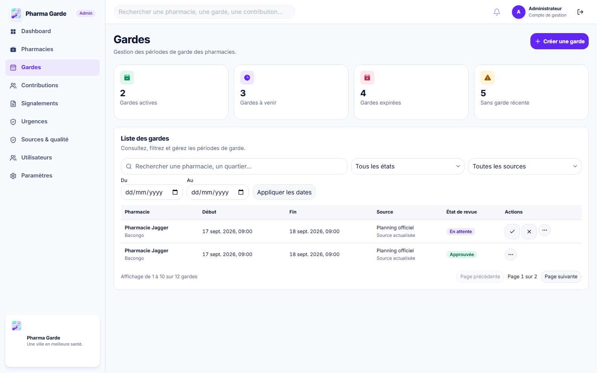
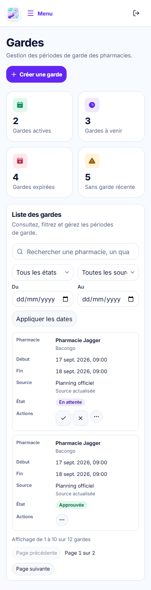
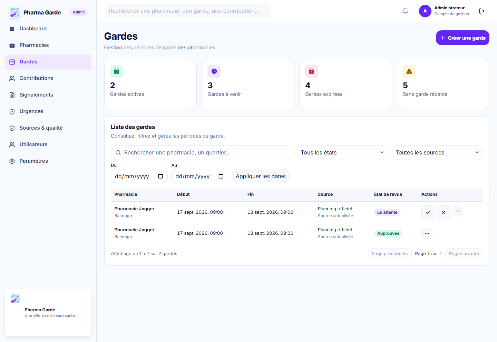

# #49 — Admin duty management, first tranche

This evidence covers `/admin/gardes` and `/admin/gardes/nouvelle` only. It does not claim visual approval or completion of the published-duty edit view. Screenshots use deterministic Playwright API responses for layout comparison; the application reads the actual admin duty, summary, pharmacy and source endpoints.

## Reference image and implementation capture

| Reference at the manifest's 1586 × 992 crop                     | Implementation at 1586 px                        |
| --------------------------------------------------------------- | ------------------------------------------------ |
|     |        |
|  |  |

| 390 px mobile adaptation                   | 1440 px desktop adaptation                   |
| ------------------------------------------ | -------------------------------------------- |
|        |        |
|  |  |

## Annotated differences

1. **KPI cards:** the four names, order, color families and filled icons follow the reference. Values come from `GET /api/v1/admin/duties/summary`; no invented percentage trends or sparklines are shown.
2. **List:** the API-backed search, review status, source, date interval and pagination replace illustrative table rows, source badges, checkboxes, sort arrows and calendar switch. Review state is not mislabelled as whether a period is currently active. Approve/reject actions appear only for PENDING rows, and “Voir la pharmacie” stays inside the ellipsis menu.
3. **Creation:** the reference's two-column hierarchy is retained at desktop and stacks at 390 px. The pharmacy, source, period, freshness and coordinates shown are resolved from the API. The preview says that a newly created period awaits distinct approval; it does not promise immediate public visibility.
4. **Map:** the existing MapLibre style renders only when the selected pharmacy has real coordinates. The capture shows loaded map tiles and a real fixture coordinate. There is no fabricated pharmacy position.
5. **Density:** the captures have two fixture duty rows instead of the reference's eight illustrative rows. The creation form is shorter because the optional internal note has no contract in this tranche. No filler records or blank note control were added to match height.
6. **Shell:** the existing product brand, account, search and sidebar replace illustrative names, counters and logo treatments in the reference. The feature does not edit shared shell primitives.

## Missing data, assets and deferred scope

No duty-specific photo, trend series, calendar data or internal note/history contract is available for this tranche. Bulk selection, calendar mode, deletion and `/admin/gardes/:id/modifier` remain open under #38/#49. In particular, editing an APPROVED duty requires the outstanding product decision; this PR does not imply that it is allowed. The reference's pharmacy photos, percentage trends and illustrative numbers are not production data.

## Responsive and interaction proof

`tests/e2e/admin-duty-ui.spec.ts` exercises 320/390/768/1440 px without document overflow; mobile list rows stack their fields without an inner horizontal scroll. It also exercises keyboard focus, date validation, PENDING create, successful approval, rejection, 409 conflict feedback, loading/empty/error, real server query parameters and pagination, and white text on primary purple actions at rest/hover/disabled. The screenshot capture runs with `WANZILA_E2E_PORT=4188 WANZILA_DUTY_CAPTURE=1 WANZILA_DUTY_LIVE_MAP=1` and waits for MapLibre readiness.

## Visual approval

Pending lead comparison and explicit approval. These are evidence captures, not an approved deviation from the design manifest. The edit mockup and all differences listed above remain open for the next tranche or #38 decision.
