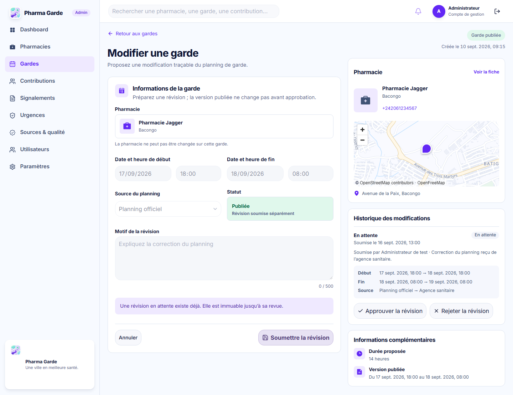
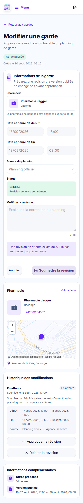

# #73 — garde publiée : révision traçable

Référence : [`admin-duty-edit.png`](../../mockups/admin-duty-edit.png), 1586 × 992.
Implémentation : `/admin/gardes/:id/modifier` depuis l’action **Modifier** du menu
ellipse de la liste. Les captures ci-dessous utilisent le même jeu de données
déterministe du test Playwright, à l’exception du fond cartographique réseau
dans les captures « live-map ». Aucune photo ou donnée d’activité n’est
créée pour ressembler à la maquette.

| Maquette                                                              | Rendu 1440 px, carte réelle                                                   | Rendu 390 px, carte réelle                                                  |
| --------------------------------------------------------------------- | ----------------------------------------------------------------------------- | --------------------------------------------------------------------------- |
|  |  |  |

Captures reproductibles avec fond cartographique déterministe :
[320 px](duty-edit-populated-320.png), [390 px](duty-edit-populated-390.png),
[768 px](duty-edit-populated-768.png), [1440 px](duty-edit-populated-1440.png).
État historique ancien inconnu : [390 px](duty-edit-legacy-390.png),
[1440 px](duty-edit-legacy-1440.png). La forme éditable sans révision
en attente est aussi capturée avec une vraie carte à
[390 px](duty-edit-legacy-390-live-map.png) et
[1440 px](duty-edit-legacy-1440-live-map.png). Une capture
[1586 × 992](duty-edit-legacy-1586-live-map.png) correspond exactement au
viewport de la PNG source pour comparer les proportions.

| Région             | Comparaison et écart non approuvé                                                                                                                                                                                                                                                                           |
| ------------------ | ----------------------------------------------------------------------------------------------------------------------------------------------------------------------------------------------------------------------------------------------------------------------------------------------------------- |
| Hiérarchie         | Même shell clair/violet, retour, statut, grande carte de formulaire à gauche et cartes pharmacie/carte/historique à droite. À 1586 px, le panneau pharmacie commence vers y164 et le formulaire vers y215, comme la référence ; à 320/390/768 px les régions s’empilent.                                    |
| Formulaire         | La pharmacie et le statut publié sont immuables selon #72, contrairement aux deux sélecteurs de la maquette. La soumission crée une révision PENDING, sans changer la version publiée. Le motif obligatoire remplace la note libre illustrée.                                                               |
| Pharmacie et carte | Identité, adresse et coordonnées proviennent de l’API. Le pictogramme neutre remplace la photographie non fournie ; le fond Wanzila/OpenFreeMap est chargé en capture réseau réelle. Aucun itinéraire n’est proposé sans origine utilisateur.                                                               |
| Historique         | Révisions, acteurs, dates et valeurs avant/proposées proviennent du registre #72. Pour une garde legacy, l’historique antérieur est explicitement inconnu ; les personnes/horaires de la maquette ne sont pas reproduits.                                                                                   |
| Actions            | Le bouton éditable violet garde un texte blanc lisible ; en présence d’une révision PENDING il devient visiblement désactivé, lilas avec texte sombre. La suppression illustrée n’a pas de contrat/politique et n’est pas offerte. Approbation et rejet utilisent une confirmation et attendent le serveur. |

La route d’une garde initialement PENDING affiche un état non éditeur et un lien
de retour à la liste ; son éditeur relève de #75, hors #73. Les états loading, 401, 403,
404, réponse mal formée, 409 et erreur générique sont couverts par tests. Les
contrôles et la liste sont vérifiés au clavier ; après revue réussie, le focus
revient sur le titre d’historique après le rechargement complet. Les captures
320/390/768/1440 et les assertions géométriques vérifient l’absence de
débordement horizontal. `approvedDeviations` reste vide dans le manifeste : ces
écarts attendent la décision de revue visuelle.
