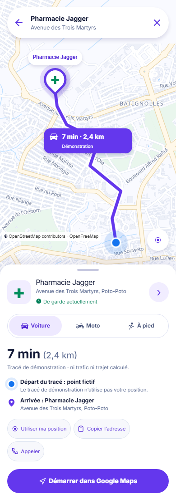
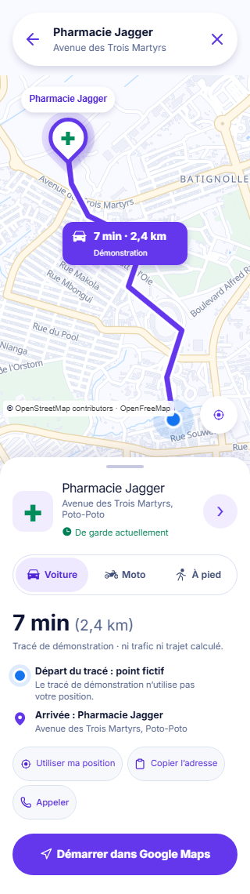
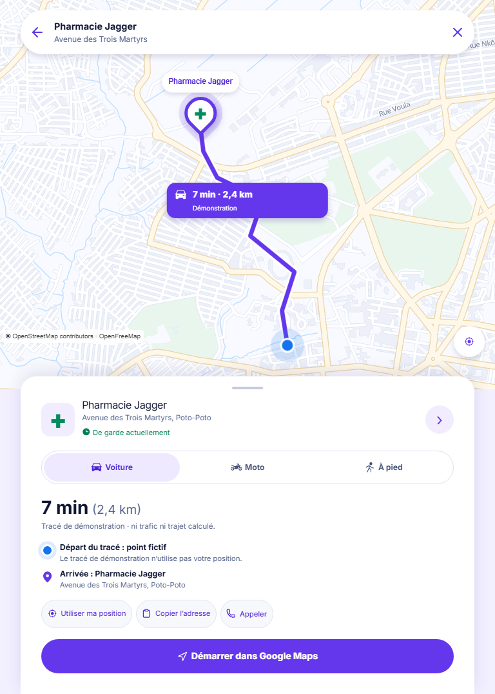
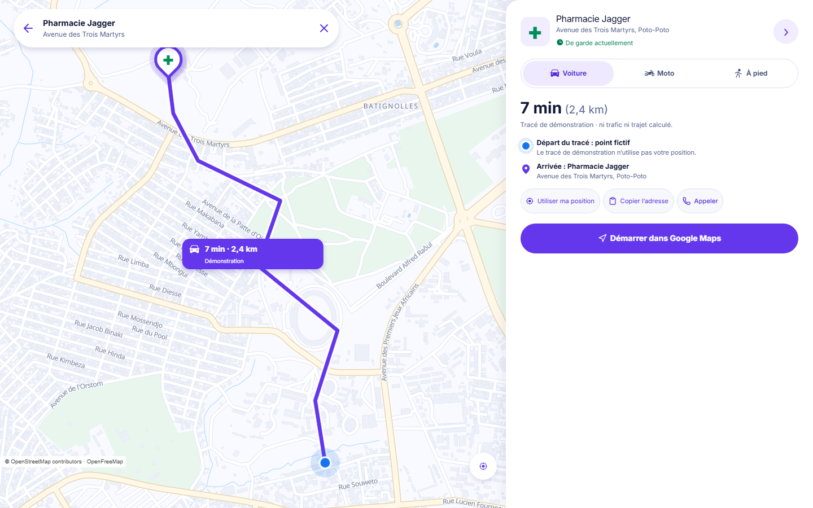

# #8 — Route preview, consent and external hand-off

The mockups are illustrative application screens, not a routing API or a source of live travel data. The browser captures below use the real Wanzila MapLibre style and OpenFreeMap tiles with a deterministic pharmacy API response. They are review evidence, **not an approved visual baseline**.

## Reference image and implementation capture

| Reference mobile route preview                                     | Implementation at 390 CSS px                           |
| ------------------------------------------------------------------ | ------------------------------------------------------ |
|  |  |

The source phone image is 941 × 1672 px. Per `reference-manifest.json`, its web-comparison content is the inner crop `(75, 126, 791, 1518)`; the phone frame, OS status bar and lavender surround are not web UI.

| Related reference                                               | Relationship to this issue                                                                                                                                   |
| --------------------------------------------------------------- | ------------------------------------------------------------------------------------------------------------------------------------------------------------ |
|  | The selected pharmacy's **Itinéraire** action now opens this route preview. The other selected-map regions remain owned by #22.                              |
|        | Active turn instructions, progress, arrival and stop controls remain owned by #23. This issue does not copy the mockup's fictitious active navigation state. |

| 320 px                                         | 768 px                                         | 1440 px                                          |
| ---------------------------------------------- | ---------------------------------------------- | ------------------------------------------------ |
|  |  |  |

## Annotated differences

1. **Map and line:** the Wanzila MapLibre style and attribution are reused from the pharmacy detail map. The route preview permits drag/zoom, while the detail map remains static. The purple line has separate white casing and main line layers. Its blue origin is labelled as a fictitious demonstration point; the destination pin uses the pharmacy's validated coordinates. The street geometry is not copied from the artwork or claimed to be calculated.
2. **Distance and time:** `7 min` and `2,4 km` are shown only for the explicit Jagger/car fixture, with **Tracé de démonstration** text in the panel and **Démonstration** on the map chip. Switching mode or destination removes the line and both figures. No live traffic claim is made.
3. **Departure:** the artwork says “Votre position” before permission, but this implementation waits for an explicit action and never presents the fixture origin as the visitor's real position. Location success, denial, unavailable, timeout, unsupported browser, retry and cancellation are separate states. A successful coordinate stays in component memory only and can be erased.
4. **Primary action:** “Démarrer” is rendered as **Démarrer dans Google Maps**, because Wanzila cannot provide turn-by-turn guidance. The external URL contains only the validated destination and supported travel mode; no visitor origin is sent by Wanzila. Google Maps may request its own location after the hand-off.
5. **Fallback:** without the map or destination coordinates, the pharmacy name, address, call and copy actions remain. The external link is withheld if destination coordinates are invalid; a missing route fixture still permits the real external hand-off.
6. **Shell and composition:** the supplied bottom sheet hierarchy, filled Phosphor travel-mode and location pictograms, purple primary action and circular map control are retained. The reference does not show the normal three-item public bottom navigation on the route screen, so the route sheet takes that space. At 1440 px the map and information panel sit side by side.

## Missing data and assets

No production routing/geocoding service, live road distance, ETA, traffic, alternative routes, turn instructions, activity watcher or arrival detection exists in this issue. There is no pharmacy photo in the public API. The map's actual streets and labels may differ from the artwork because the coordinate is a fixture and the tiles are genuine. The fixture is not used for other pharmacies. The map test in CI uses a deterministic no-network style; live-map capture is opt-in only.

## Responsive and interaction proof

`tests/e2e/route-preview.spec.ts` covers 320/390/768/1440 px without horizontal overflow, detail and selected-map hand-off, map drag without location permission, explicit geolocation request, denial, unavailable, timeout, unsupported browser, retry, cancellation of a pending callback, route-fixture isolation, invalid coordinates, map failure, external-link safety and keyboard access. `apps/web/src/features/navigation/route-preview.test.ts` asserts the pure route and URL boundaries. The capture above was generated with `WANZILA_ROUTE_LIVE_MAP=1` and `WANZILA_ROUTE_CAPTURE_DIR=docs/design/evidence/issue-8`; CI does not use that opt-in.

## Visual approval

Pending lead comparison against all three mockups and explicit approval. The recorded differences are visible decisions, not blanket approval to deviate from the manifest.
